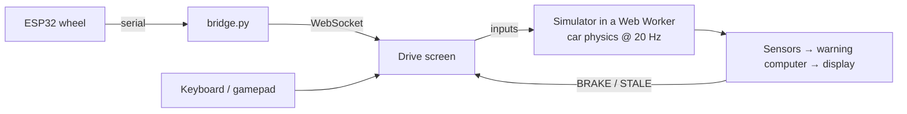

<div align="center">


# ApexTrace

### Find the failure before the wall does.


</div>

---

**334 km/h to 76 km/h in 2.8 seconds.** That's turn one at Monza. The car covers 93 metres every second, and the message that tells the driver *brake now* has to arrive at exactly the right moment.

**ApexTrace is a 2026-spec F1 driving simulator with a braking-warning system on board.** You drive; the warning computer watches what the car reports and calls **BRAKE** at the last safe moment. Then the safety report scores how you reacted to every call.

It all runs in your browser: no server, nothing to install.

---

## 🏎️ Drive

- **Real Monza and Baku layouts:** 5.8 km and 6.0 km, every corner where it should be.
- **A 2026-regulation car:** load-sensitive tyres, downforce, active aero, a 400 kW engine with a 350 kW hybrid kick, traction control and ABS. Tune the assists, gearbox, DRS and battery mode in *Car setup*.
- **Kerbs, grass and walls that bite back:** they all grip differently, and walls stop you dead.
- **Engine sound built live from your revs:** gear-shift cuts, overrun crackle and tyre squeal.
- **A best-lap ghost, a racing line, lap deltas and track limits.**
- **Drive it with the keyboard, a gamepad,** or [our cardboard wheel](#-the-wheel-yes-its-cardboard).

## 🔧 The wheel (yes, it's cardboard)

Our 3D printer never showed up. So we built it out of premium, aerospace-grade cardboard.

- **ESP32** brain, talking to the browser through a Python serial-to-WebSocket bridge
- **2× MPU6050 IMUs** (accelerometer + gyro): tilt the wheel to steer, smoothed with a One-Euro filter
- **HW-504 joystick:** push forward for throttle, pull back to brake, click to reset to the grid
- **1.69" ST7789 colour screen:** your speed, the link status, and a big red **BRAKE**
- **2× SG90 servos:** rumble on kerbs, crashes and warnings


<sub>Wiring overview. Exact pin assignments live in [`embedded-firmware/steering-wheel/steering-wheel.ino`](embedded-firmware/steering-wheel/steering-wheel.ino).</sub>

## ⚙️ How it works



The simulator ([`frontend/src/sim`](frontend/src/sim)) runs on its own thread, so the car keeps real time however long the 3D scene takes to draw. It is a line-for-line TypeScript port of the project's original Python simulator, and its tests replay sessions recorded from that simulator: every tick must match.

The warning shows **BRAKE** at the last safe moment:

$$d_{warn} = \frac{v^2 - v_{corner}^2}{2\,a_{brake}} + v\,t_{react} + d_{margin}$$

It only knows what the car's sensors *report*. If that data is more than 0.3 s old it can't trust it, and the driver sees **WARNING DATA STALE** instead.

## 🚀 Run it

```bash
cd frontend && npm install && npm run dev

# only with the wheel, in a second terminal
python embedded-firmware/bridge.py
```

Open **http://localhost:5173** and hit *Start session*. Controls, the optional detailed car model and the tests are in **[docs/SETUP.md](docs/SETUP.md)**.

It deploys as a static site: `npm run build` and serve `frontend/dist` (the live one is on Vercel).

## 🧰 Built with

TypeScript · React · Vite · three.js · React Three Fiber · Web Workers · Web Audio · ESP32 · Arduino · Python (wheel bridge) · Vitest · Puppeteer · cardboard

## 👥 Team

**Aaryan Ved Bhalla · Kahn Shah · Shayan Mazahir**

Built for Formula Tech Hacks 2026.

<sub>ApexTrace is an F1-inspired prototype: a simplified car model, not real team data or certification.</sub>
